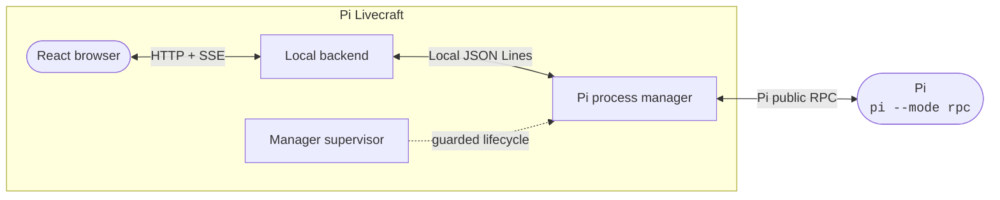

<div align="center">

# Pi Livecraft

**Pi does the clever part. Livecraft gives it a browser, and gives you the screwdriver.**

A local web workbench for Pi that is meant to be forked, reshaped, simplified, and occasionally made a little strange.

[](https://pi.dev)
[](https://github.com/sebastienservouze/pi-livecraft/fork)
[](LICENSE)

[Why Livecraft?](#why-livecraft) · [Quick start](#quick-start) · [What is included](#what-is-already-in-the-box) · [Make it yours](#forks-are-the-point) · [Docs](/docs/README.md)

</div>

<p align="center"></p>
<p align="center"><sub>Pi reshaping the interface that is currently displaying its session. A small and pleasing loop.</sub></p>

## Pi is the clever part

Pi owns the providers, models, sessions, history, tools, commands, and extensions. It reasons, writes the code, and runs the tools. Livecraft does not replace that runtime or duplicate its configuration. It talks to `pi --mode rpc` through Pi's public protocol and presents the result in a local React interface.

You still configure Pi as usual. Livecraft asks Pi what is available and displays it. Its own settings are deliberately less exciting: themes, shortcuts, panel sizes, drafts, and a few local workflow preferences.

Think of Livecraft as an intentionally oversized, editable web extension around Pi. The useful idea comes from Pi's small, composable design and public APIs. Livecraft is merely one enthusiastic consequence of that design.

## Why Livecraft?

Pi is already excellent in a terminal. Some interactions simply benefit from a visual surface: comparing token usage between turns, keeping an eye on several sessions, reading a large diff, answering a structured question, or jumping from an analysis chart back to the tool call that caused the spike.

Livecraft provides that surface, but the more interesting part is that Pi can modify it while you use it. Notice something annoying, ask Pi to change the application, review the diff, and try the result without abandoning the session that started the work. Frontend and backend updates preserve Pi processes. Changes to the manager wait for an explicit guarded restart, because surprise restarts are rarely delightful.

The repository includes focused guides for its main composition points. Point Pi at the [documentation index](/docs/README.md) and it can usually find the right owner and the smallest relevant check without turning the whole codebase into an archaeological site.

## Quick start

You need **Node.js 24+**, **npm**, and a configured **Pi**. Linux and WSL are supported.

**[Fork the repository](https://github.com/sebastienservouze/pi-livecraft/fork)**, then run:

```bash
git clone https://github.com/YOUR-USERNAME/YOUR-REPOSITORY.git
cd YOUR-REPOSITORY
npm install
npm run dev
```

Open [http://127.0.0.1:5173](http://127.0.0.1:5173). That is the whole ceremony.

> [!WARNING]
> **Pi is not sandboxed.** It runs with your user permissions and can read files, modify code, and execute commands. Keep important work under version control and review Git actions before confirming them. Livecraft limits network exposure by listening only on `127.0.0.1`.

## What is already in the box

### Work with Pi

- **Workspaces and parallel sessions:** create, switch, reopen, and monitor Pi sessions across several directories. Active and newly completed sessions stay visible so attention can move without guesswork.
- **A Pi-native composer:** send text and images, use slash commands, stop a request, choose models and thinking levels exposed by Pi, and steer or queue follow-ups while Pi is working.
- **Per-session drafts:** unfinished prompts survive session switches and failed sends.
- **Optional prompt rewrites:** ask a disposable Pi process for a rewrite without changing the current conversation.
- **Extension dialogs:** handle Pi's standard select, confirm, input, and editor requests, plus versioned structured questionnaires from Livecraft extensions.
- **Optional agent picker:** when Pi exposes the `/agent` command, Livecraft can present its available agents without taking ownership of their configuration.

### See what Pi is doing

- **Live conversations:** responses, activity, tool execution, usage, costs, and errors update as Pi emits them.
- **Readable tool calls:** inspect inputs and outputs, edit diffs, and previews for code and text files. HTML, SVG, and Markdown can render directly in a sandboxed or bounded preview, with source still available.
- **Conversation actions:** copy message text or the input and output of a tool call without opening another panel.
- **Session analysis:** inspect context, tokens, cost per turn, model activity, tool activity, and failures, then jump back to the relevant message or call.

### Keep workspace tools nearby

- **[Git](/src/features/git/README.md):** review status, diffs, changed files, and unpushed commits; commit, push, reset, or revert while keeping the conversation in view.
- **[Provider quotas](/src/features/quotas/README.md):** monitor normalized OpenAI Codex and GitHub Copilot usage windows.
- **[Todos](/src/features/todo/README.md):** maintain an ordered task list per workspace and start a Pi session from a task.
- **[Terminal](/src/features/terminal/README.md):** open an external Linux or WSL terminal in the current workspace from the rail, palette, or a shortcut.
- **[Session analysis](/src/features/session-analysis/README.md):** keep the session's requests, models, tools, costs, and failures one click away.

### Shape the workbench

- **Command palette and editable shortcuts:** commands share one registry, including commands generated automatically for sidebar widgets.
- **Local preferences:** themes, conversation display, workspace restoration, shortcuts, terminal command, panel sizes, and widget state stay in the browser.
- **Flexible layout:** resize or collapse the side panels and keep the tools useful to your workflow.
- **Notifications:** transient notices and persistent errors remain visible without inventing another global notification universe.

## Forks are the point

This repository is a starting point, not a subscription. Your fork is expected to diverge, and there is no prize for keeping it synchronized with upstream. Use it for a while, notice a small friction, ask Pi to remove that friction, and repeat until the application fits the way you work.

A few reasonable first mutations:

- turn a repeated prompt or workspace command into a one-click action;
- give an important Pi tool a presentation that matches its output;
- add a right-rail widget for context you repeatedly hunt down;
- combine messages, forms, and actions into a recurring workflow;
- remove every feature you do not enjoy using;
- add something objectively unnecessary but personally delightful.

There is no canonical setup. The original repository only moves forward through bug fixes. New workflows and product choices belong in the forks that need them. That is not fragmentation here. That is the plan.

## Where to start changing things

The README shows what exists. The guides explain where to put the next idea without making you memorize the repository first.

| You want to... | Start here |
| --- | --- |
| Change the composer | [Composer guide](/docs/HOW-TO-COMPOSER.md) |
| Add an action to a message or tool call | [Conversation action guide](/docs/HOW-TO-CONVERSATION-ACTION.md) |
| Give a Pi tool a custom presentation | [Tool presentation guide](/docs/HOW-TO-TOOL-PRESENTATION.md) |
| Add a palette command or shortcut | [Palette command guide](/docs/HOW-TO-PALETTE-COMMAND.md) |
| Add a setting or theme | [Settings guide](/docs/HOW-TO-SETTINGS.md) and [theme guide](/docs/HOW-TO-THEME.md) |
| Add a sidebar widget | [Widget guide](/docs/HOW-TO-WIDGET.md) and [widget contracts](/src/features/right-sidebar/README.md) |
| Present UI from a Pi extension | [Dialog contract](/src/features/dialogs/README.md) and [Pi extensions](/pi-extensions/README.md) |
| Send another command to Pi | [Pi RPC guide](/docs/HOW-TO-TALK-TO-PI.md) |
| Run a prompt without touching the session | [Isolated prompt guide](/docs/HOW-TO-RUN-ISOLATED-PROMPT.md) |
| Cross frontend, backend, manager, or Pi boundaries | [Architecture guide](/docs/ARCHITECTURE.md) |

The [documentation index](/docs/README.md) links the feature contracts, backend capabilities, widgets, and focused checks behind each surface.

## Under the hood, briefly



The manager is the sole owner of Pi processes. This lets Vite update the interface and lets the backend restart without closing active sessions. Manager runtime changes produce a persistent notice instead of an interruption. A replacement happens only after the user requests it and the manager confirms that Pi is idle. Sessions remain available in history afterwards.

Livecraft uses Pi's public RPC and extension APIs for everything Pi-related. Local capabilities such as Git, todos, terminal launching, and browser preferences stay on the Livecraft side of the boundary. Read the [architecture guide](/docs/ARCHITECTURE.md) for the full flow and the [manager lifecycle guide](/docs/MANAGER-LIFECYCLE.md) before touching process supervision.

## Optional Pi extras

These are configured in Pi. Livecraft simply knows how to make their results pleasant to use.

- **[@nerisma/pi-agents](https://github.com/sebastienservouze/pi-agents):** adds specialized agents with focused prompts, restricted tool sets, and isolated delegation. When Pi exposes `/agent`, Livecraft displays an agent picker.
- **[pi-auto-title](https://github.com/sebastienservouze/pi-auto-title):** names sessions from their first prompt, which makes parallel histories much easier to scan.

<details>
<summary><strong>Troubleshooting</strong></summary>

- `pi: command not found`: install Pi globally and verify that `pi --version` works in the shell used to start Livecraft.
- The manager or backend is unavailable: check ports `43120` and `43121`, or set `PI_LIVECRAFT_MANAGER_PORT` and `PI_LIVECRAFT_BACKEND_PORT`. After a manager crash, restart `npm run dev`; the supervisor intentionally does not relaunch it automatically.
- A new session cannot answer: launch Pi once, configure a provider with `/login`, and verify that the `/agent` extension is available if your setup expects it.
- Linux desktop actions unavailable: install or expose `xdg-open` and `x-terminal-emulator` in `PATH`.
- WSL desktop actions unavailable: verify that `explorer.exe`, `wslpath`, and `wt.exe` are available in the WSL `PATH`.

</details>

<details>
<summary><strong>Development checks</strong></summary>

Run the narrowest check that covers your change. For a larger change, the full local set is:

```bash
npm run typecheck
npm run lint
npm test
npm run build
```

The Pi RPC integration test additionally requires a configured Pi installation.

</details>

## Built with Pi, for Pi ❤️

Pi Livecraft exists because Pi is unusually pleasant to extend and unusually good at understanding the software around it. The clever architecture is Pi's. This repository is what happened when someone enjoyed that architecture a little too much.

## Contributing

Focused bug reports and bug fixes are welcome upstream. Workflow features belong in the forks that need them, with no obligation to send them back or keep them synchronized.

## License

Pi Livecraft is available under the [MIT License](/LICENSE).
