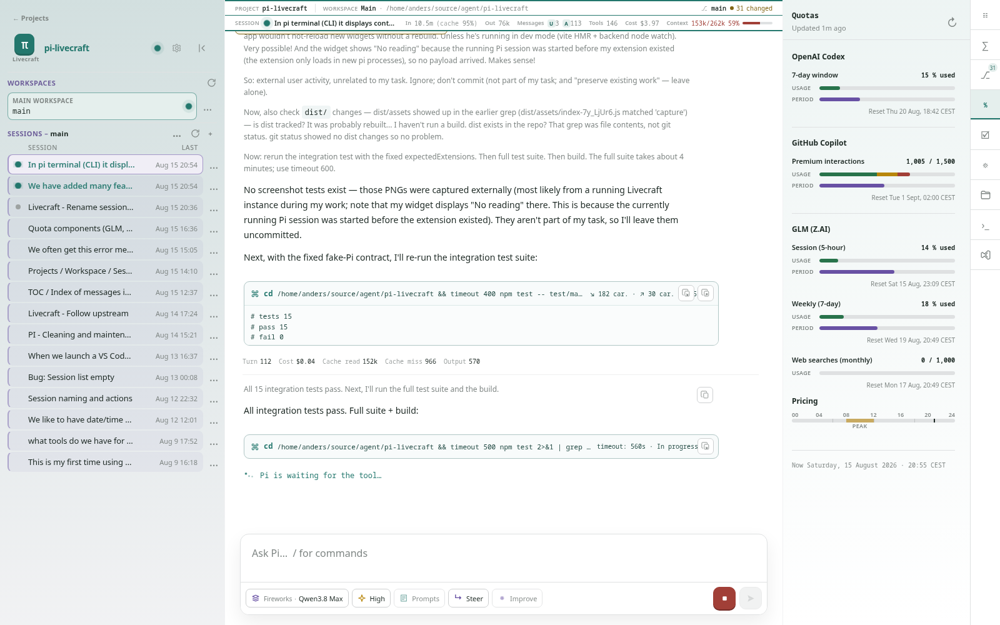
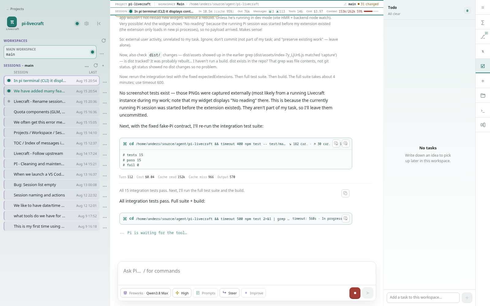
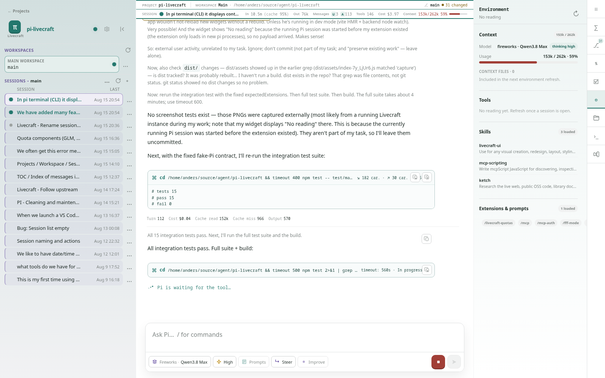

# Andulv fork feature overview

This document is specifically for [andulv/pi-livecraft](https://github.com/andulv/pi-livecraft). It lists features and improvements added by this fork; it is **not** a catalogue of standard Pi Livecraft functionality.

## Comparison baseline

The baseline is the fork's `upstream/main` at `434d983` (`Auto-dismiss error notifications`). Everything below was added after that official-project baseline, or is part of the fork's current in-progress work.

For context, the official project is [sebastienservouze/pi-livecraft](https://github.com/sebastienservouze/pi-livecraft). Standard features that were already present upstream are intentionally omitted unless this fork changed them.

> Screenshots were captured from the fork's running local instance at `http://127.0.0.1:5173/`. They show live local data; paths, counts, usage, and session contents may differ.

## 1. Project, workspace, worktree, and multi-session management

### Project and workspace hierarchy

- Added a project home page and project-scoped workspace views.
- Organize sessions by Git project instead of showing one undifferentiated session list.
- Discover the main checkout and linked worktrees from Git and use them as the workspace source of truth.
- Show workspace activity, session status, branch divergence, and the current Git context.
- Refresh workspace discovery independently from session-list refreshes.
- Start sessions lazily from a workspace and reuse or discard empty sessions safely.
- Add workspace and session action menus, including opening an exact worktree in branded VS Code.

### Session organization and persistence

- Add project-pinned sessions with stable ordering and project-aware resolution.
- Add workspace-session archiving without modifying Pi's session files.
- Preserve Pi-owned session names and keep renamed active sessions stable.
- Add explicit session load states, reduced session-list scanning, and refresh controls.
- Show session first and last activity times, weekday/date labels, and richer status/usage summaries.
- Scope extension dialogs to the selected session.

### Project navigation and identity

- Add readable project URLs with stable project suffixes.
- Persist project, workspace, and session selection in the URL.
- Add project-aware browser titles, favicons, and project colours.
- Promote project navigation to a sidebar link and keep project cards as native links.
- Keep the collapsed right rail above the top bar and refine project/workspace hierarchy and branding.

## 2. Other fork additions and improvements

### Model selection and pricing

- Rebuild the model picker around providers, model metadata, costs, and pinning/favourites.
- Mark models covered by a plan instead of presenting them as ordinary priced models.
- Derive GLM list prices from sibling provider information when the provider does not expose them directly.
- Keep model selection available immediately when a new session is started.

### Provider quotas

- Add the quota rail summary and a provider quota panel.
- Add OpenAI Codex usage windows and elapsed-period comparison.
- Add GitHub Copilot usage and period comparison.
- Add Z.AI/GLM Coding Plan quota support, including elapsed periods and provider errors.
- Segment time-bound quota bars by pace so usage can be compared with elapsed period progress.
- Show current time and timezone-aware reset labels.
- Add Z.AI peak-pricing hours, peak-window labels, timeline polish, and pricing/footer improvements.
- Show both GLM five-hour and weekly windows in the rail and quota panel.

### Message table of contents

- Add the Session Index right-sidebar widget as a navigable message TOC.
- Show user messages in chronological order with message numbers and dates.
- Preview the final assistant response beneath each user turn.
- Navigate from an index entry back to the corresponding conversation message.

### Session environment widget *(current fork work)*

- Add a right-sidebar view of what the selected Pi session has loaded.
- Show the model, thinking level, context-window pressure, and context files.
- List configured tools with descriptions, source, active state, parameter schemas, and filtering.
- Show loaded skills, extension commands, and prompt templates with their locations.
- Add a versioned Pi extension and backend cache/service for environment status.

### Status and interaction polish

- Move project, workspace, Git, session, token, cache, cost, and context information into a fuller chat top bar.
- Expand session usage statistics and improve status presentation for active and completed work.
- Improve quota bars, reset-time alignment, labels, dividers, and provider pricing presentation.
- Improve session-index dates and session-list timestamps for scanning long histories.
- Preserve accessible, session-scoped dialogs and avoid false duplicate-request notices during session switches.

## What is deliberately not listed here

The following are standard Pi Livecraft capabilities inherited from the official project and are not presented as Andulv fork additions:

- the basic Pi conversation loop and generic composer;
- standard Git, terminal, settings, notifications, and command-palette surfaces;
- standard tool-call rendering, conversation actions, forks, and session analysis;
- the underlying local backend, manager, RPC, and browser architecture.

This document should be updated when a fork-specific feature is merged, and compared against the official baseline before describing it as an Andulv addition.

## Fork implementation references

- [Workspace fork contract](/src/features/workspace/README.md)
- [Quota fork contract](/src/features/quotas/README.md)
- [Session index fork contract](/src/features/session-index/README.md)
- [Session environment fork contract](/src/features/session-environment/README.md)
- [Composer/model selection](/src/features/composer/README.md)
- [Andulv fork repository](https://github.com/andulv/pi-livecraft)
- [Official Pi Livecraft repository](https://github.com/sebastienservouze/pi-livecraft)
