# Carte des documentations — Pi Livecraft

> Graphe complet des liens entre tous les fichiers `README.md` et `*.md` de documentation du projet.
> Généré le 2026-07-25. Maintenir à jour quand une doc référence une autre doc.

```mermaid
flowchart TD
  %% ═══════════════════════════════════════════
  %% Entry Points
  %% ═══════════════════════════════════════════
  subgraph ENTRY["🎯 Points d'entrée"]
    AGENTS["AGENTS.md\n(instructions agent)"]
    ROOT["README.md\n(présentation projet)"]
  end

  %% ═══════════════════════════════════════════
  %% Cross-cutting Guides (docs/)
  %% ═══════════════════════════════════════════
  subgraph DOCS["📘 Guides transverses (docs/)"]
    DOCS_IDX["docs/README.md\n(index documentations)"]
    ARCH["docs/ARCHITECTURE.md\n(architecture système)"]
    HOW_CMD["docs/HOW-TO-PALETTE-COMMAND.md\n(ajouter commande palette)"]
    HOW_WID["docs/HOW-TO-WIDGET.md\n(ajouter widget)"]
    HOW_TOOL["docs/HOW-TO-TOOL-PRESENTATION.md\n(présenter un tool call)"]
    HOW_PI["docs/HOW-TO-TALK-TO-PI.md\n(parler à Pi)"]
  end

  %% ═══════════════════════════════════════════
  %% Frontend Features (src/)
  %% ═══════════════════════════════════════════
  subgraph FRONTEND["🖥️ Frontend (src/)"]
    CMP["src/components/README.md\n(composants partagés)"]
    FEAT_IDX["src/features/README.md\n(carte des features)"]
    FEAT_CMD["src/features/commands/README.md\n(commandes & raccourcis)"]
    FEAT_CONV["src/features/conversation/README.md\n(présentations tool calls)"]
    FEAT_SET["src/features/settings/README.md\n(préférences)"]
    FEAT_RSB["src/features/right-sidebar/README.md\n(panneau latéral droit)"]
    FEAT_GIT["src/features/git/README.md\n(Git frontend)"]
    FEAT_QTA["src/features/quotas/README.md\n(quotas frontend)"]
    FEAT_TERM["src/features/terminal/README.md\n(terminal frontend)"]
    FEAT_TODO["src/features/todo/README.md\n(todo frontend)"]
    FEAT_SA["src/features/session-analysis/README.md\n(analyse de session)"]
  end

  %% ═══════════════════════════════════════════
  %% Backend Features (server/)
  %% ═══════════════════════════════════════════
  subgraph BACKEND["⚙️ Backend (server/)"]
    SVR_IDX["server/features/README.md\n(capacités backend)"]
    SVR_GIT["server/features/git/README.md\n(Git backend)"]
    SVR_QTA["server/features/quotas/README.md\n(quotas backend)"]
    SVR_TERM["server/features/terminal/README.md\n(terminal backend)"]
    SVR_TODO["server/features/todos/README.md\n(todos backend)"]
  end

  %% ═══════════════════════════════════════════
  %% External / Extensions
  %% ═══════════════════════════════════════════
  subgraph EXTERNAL["🌐 Externe / Extensions"]
    EXT["pi-extensions/README.md\n(extensions Pi chargées)"]
    RPC["Pi RPC Protocol\n(❄ externe, npm global)"]
  end

  %% ═══════════════════════════════════════════
  %% Edges — Entry Points
  %% ═══════════════════════════════════════════
  AGENTS --> ARCH
  AGENTS --> DOCS_IDX

  ROOT --> ARCH
  ROOT --> DOCS_IDX
  ROOT --> FEAT_IDX

  %% ═══════════════════════════════════════════
  %% Edges — docs/ hub
  %% ═══════════════════════════════════════════
  DOCS_IDX --> ARCH
  DOCS_IDX --> FEAT_IDX
  DOCS_IDX --> HOW_CMD
  DOCS_IDX --> FEAT_CMD
  DOCS_IDX --> FEAT_SET
  DOCS_IDX --> HOW_WID
  DOCS_IDX --> FEAT_RSB
  DOCS_IDX --> HOW_TOOL
  DOCS_IDX --> FEAT_CONV
  DOCS_IDX --> SVR_IDX
  DOCS_IDX --> HOW_PI
  DOCS_IDX --> CMP
  DOCS_IDX --> EXT

  %% ═══════════════════════════════════════════
  %% Edges — Architecture
  %% ═══════════════════════════════════════════
  ARCH --> FEAT_IDX
  ARCH --> FEAT_CMD
  ARCH --> FEAT_SET
  ARCH --> FEAT_RSB
  ARCH --> SVR_IDX

  %% ═══════════════════════════════════════════
  %% Edges — How-to → How-to (cross-guide)
  %% ═══════════════════════════════════════════
  HOW_WID --> HOW_CMD

  %% ═══════════════════════════════════════════
  %% Edges — Frontend Features Index
  %% ═══════════════════════════════════════════
  FEAT_IDX --> FEAT_CONV
  FEAT_IDX --> FEAT_CMD
  FEAT_IDX --> FEAT_SET
  FEAT_IDX --> FEAT_RSB
  FEAT_IDX --> ARCH

  %% ═══════════════════════════════════════════
  %% Edges — Feature README → How-to / other doc
  %% ═══════════════════════════════════════════
  FEAT_CONV --> HOW_TOOL
  FEAT_CMD --> HOW_CMD
  FEAT_CMD --> FEAT_RSB
  FEAT_SET --> FEAT_CMD
  FEAT_SET --> FEAT_RSB
  FEAT_RSB --> HOW_WID
  FEAT_RSB --> FEAT_GIT
  FEAT_RSB --> FEAT_QTA
  FEAT_RSB --> FEAT_TERM
  FEAT_RSB --> FEAT_TODO
  FEAT_RSB --> FEAT_SA

  %% ═══════════════════════════════════════════
  %% Edges — Backend Features Index
  %% ═══════════════════════════════════════════
  SVR_IDX --> SVR_GIT
  SVR_IDX --> SVR_QTA
  SVR_IDX --> SVR_TERM
  SVR_IDX --> SVR_TODO

  %% ═══════════════════════════════════════════
  %% Edges — External
  %% ═══════════════════════════════════════════
  HOW_PI --> RPC

  %% ═══════════════════════════════════════════
  %% Dotted: frontend/backend widget pairs
  %% (implicit architectural relationship)
  %% ═══════════════════════════════════════════
  FEAT_GIT -.-> SVR_GIT
  FEAT_QTA -.-> SVR_QTA
  FEAT_TERM -.-> SVR_TERM
  FEAT_TODO -.-> SVR_TODO
```

---

## Légende

| Symbole | Signification |
|---------|---------------|
| `→` (pleine) | Lien explicite dans le contenu de la doc source |
| `⇢` (pointillée) | Paire frontend/backend implicite (même feature, couches différentes) |
| `❄ externe` | Documentation hors dépôt, installée avec Pi |

---

## Statistiques

| Métrique | Valeur |
|----------|--------|
| Nœuds totaux | **25** |
| Liens explicites (pleins) | **46** |
| Liens implicites (pointillés) | **4** |
| Docs sans lien sortant | 13 (widgets frontend/backend, `src/components/`, `pi-extensions/`, how-to sans renvoi amont) |
| Docs les plus référencées | `docs/ARCHITECTURE.md` (5 entrants), `docs/README.md` (3), `src/features/README.md` (4) |
| Docs les plus référençantes | `docs/README.md` (13 sortants), `ARCHITECTURE.md` (5), `AGENTS.md` (2) |

---

## Analyse rapide

### ✅ Bien couvert
- **Hiérarchie claire** : `AGENTS.md` → `docs/README.md` → `docs/ARCHITECTURE.md` → features
- **Boucle guide→référence** : chaque `HOW-TO-*.md` a son `README.md` de contrat dans la feature visée, et chaque feature README renvoie vers le how-to
- **Frontend/Backend** : bien séparés, `server/features/README.md` est le hub unique pour le backend

### ⚠️ Points d'attention
- **`pi-extensions/README.md`** est isolé — seul `docs/README.md` y mène. `ARCHITECTURE.md` ne le référence pas.
- **Widgets frontend** (git, quotas, terminal, todo, session-analysis) sont des feuilles — ils décrivent leur contrat mais ne renvoient vers aucun guide ou doc amont. Si quelqu'un atterrit directement dessus, il n'a pas de fil d'Ariane.
- **`docs/HOW-TO-TALK-TO-PI.md`** est isolé dans `docs/` : il n'est lié que depuis `docs/README.md`. `ARCHITECTURE.md` ne le mentionne pas alors que tout ajout de feature backend pourrait en avoir besoin.
