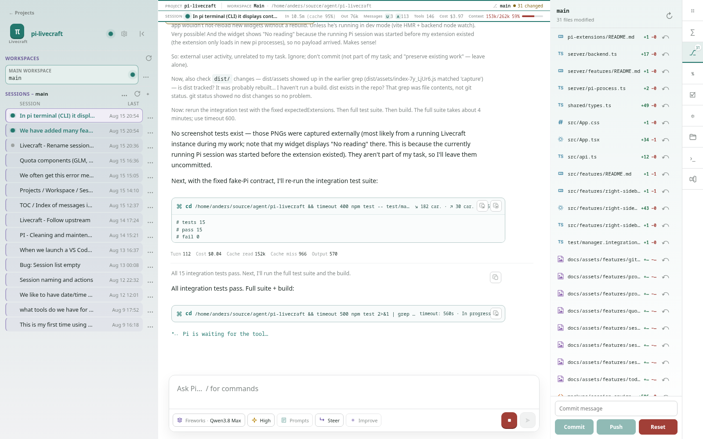
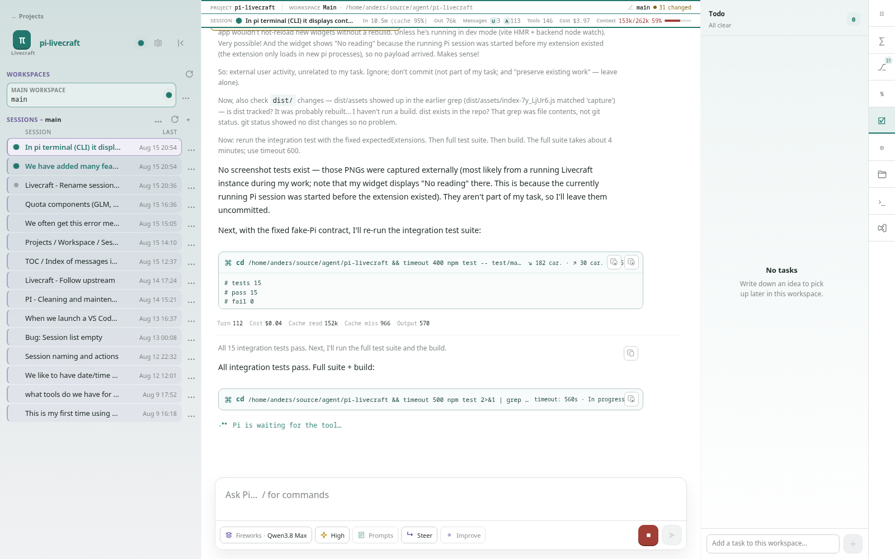

# Pi Livecraft feature overview

Pi Livecraft has grown from a browser view of one Pi conversation into a local development workbench. This is a user-facing inventory of the major features and improvements currently available.

> The screenshots in this document were captured from a running local instance at `http://127.0.0.1:5173/`. They show live local data, so names, counts, paths, usage, and session contents may differ on another installation.

## Projects, workspaces, worktrees, and sessions

### Project registry and project pages

- Register local Git repositories from the project home page.
- Validate repository paths through Git discovery before adding them.
- Open each project at a readable, stable URL such as `/project/pi-livecraft-4a3ab1ac`.
- Preserve the selected project, workspace, and session in the URL for reloads, duplicate tabs, and browser history.
- Give each project its own accent colour, browser title, and favicon.
- Keep project cards as native links so normal browser navigation still works.

### Workspaces and linked worktrees

- Treat the main checkout and linked Git worktrees as selectable workspaces.
- Show branch, path, activity, and Git status in the project view.
- Refresh workspace discovery when a new worktree is created.
- Open the selected worktree directly in VS Code.
- Launch a native terminal in the current workspace from the rail, command palette, or shortcut.

### Multi-session management

- Create, select, reopen, rename, and close Pi sessions without leaving the project.
- Start new sessions lazily and keep a live empty session available for immediate model selection.
- Group sessions under their owning project and workspace.
- Show active, completed, and current-page turn-complete status at a glance.
- Display first and last activity times, session names, message counts, and usage summaries.
- Pin important sessions at project scope and retain their order across reloads.
- Archive sessions without modifying Pi's session files, then reveal archived sessions on demand.
- Restore workspace and session selection through browser navigation.

## Conversation and composer improvements

### Pi-native composer

- Send text and up to four prepared images.
- Paste images with client-side resize and compression before sending.
- Use slash commands with autocomplete and keyboard navigation.
- Select the agent, model, thinking level, prompt templates, and next-message behaviour exposed by Pi.
- See provider/model names, pricing, favourites, and plan-covered model pricing in the model selector.
- Choose **Steer** or **Follow up** while Pi is running.
- Stop an in-flight request and guard against duplicate sends.
- Improve a prompt through an isolated rewrite flow with an explicit before/after comparison.
- Save and insert prompt templates.
- Persist one draft per session and restore it after a failed send.

### Live conversation and tool results

- Stream assistant output, activity, tool execution, usage, costs, and errors in real time.
- Switch between simplified, semi-detailed, and detailed conversation views.
- Render tool calls with previews, expandable output, status, argument/output sizes, and duration information.
- Render HTML, SVG, Markdown, and CSV results directly while keeping a source view available.
- Copy message text, tool input, and tool output from contextual actions.
- Open files produced by successful `read`, `write`, and `edit` calls.
- Fork a conversation from a user message and continue from that point.

### Message table of contents

- Show user messages as a compact chronological session index.
- Include the final assistant response as a muted one-line preview for each turn.
- Display dates, times, and message counts to make long sessions scannable.
- Jump directly to a user message or tool call in the conversation, loading history as needed.
- Highlight the selected destination after navigation.

## Quotas, model context, and workspace tools

### Provider quotas

- Compare OpenAI Codex, GitHub Copilot, and GLM (Z.AI) usage in one panel.
- Show usage values, elapsed-period pace, progress bars, and reset times.
- Display both GLM five-hour and weekly windows, plus monthly web-search usage.
- Visualize pace with green, yellow, and red segments when a period is known.
- Show Z.AI peak-pricing hours on a local-day timeline.
- Keep the last valid reading visible when refresh fails and mark it stale.
- Isolate provider errors so one unavailable provider does not hide the others.
- Surface a compact provider percentage in the right rail.

### Session analysis

- Summarize total, average, and median turn cost.
- Track assistant turns, tool calls, failures, cache activity, context usage, and output tokens.
- Rank turns and tools by cost, input size, output size, duration, or failure.
- Show tool distribution and the user requests that caused the most model cost.
- Navigate from charts and ranked rows back to the corresponding message or tool call.
- Optionally request a concise isolated interpretation without changing the active session.

### Session environment

- Show the selected model, thinking level, and context-window pressure.
- List context files with their paths and sizes without exposing their contents.
- Inspect configured tools, their descriptions, sources, active state, and parameter schemas.
- Filter tools by name or description.
- Show loaded skills, extension commands, and prompt templates with their source paths.

### Git workspace panel

- Review branch state, clean/dirty status, changed files, line counts, and unpushed commits.
- Inspect line-numbered diffs without leaving the conversation.
- Commit all changes, push, discard selected or all uncommitted changes, reset the latest unpushed commit, or revert an unpushed commit.
- Confirm destructive actions and keep errors visible in the panel.

### Workspace todos

- Keep a small task list attached to each workspace.
- Add, edit, complete, delete, and deliberately reorder tasks.
- Preserve an unfinished task draft across reloads.
- Start a new Pi session with a task ready for editing, or send it immediately.
- Link a task to its originating session and navigate back to that session.

## Workbench and local-first improvements

- Use a resizable right sidebar with a rail for session index, analysis, Git, quotas, todos, environment, terminal, and external-app actions.
- Open widgets from the command palette; assign and edit keyboard shortcuts from Settings.
- Persist themes, panel sizes, sidebar state, conversation view, workspace restoration, shortcuts, and composer drafts in browser-local storage.
- Create editable Light and Dark colour themes from a small set of source colours.
- Handle Pi select, confirm, input, editor, and structured questionnaire requests in browser dialogs.
- Show transient notices and persistent errors with accessible dismissal and session scoping.
- Keep Pi processes alive across frontend hot reloads and backend restarts through the separate manager process.
- Detect manager runtime changes and offer a guarded manual restart only when it is safe.

## Notable polish added along the way

- Readable project slugs and project-aware browser tabs.
- Native project navigation and clearer project/workspace hierarchy.
- Session pinning, archiving, stable renamed titles, and human-friendly dates.
- Workspace and session refresh controls at the appropriate ownership boundaries.
- Quota reset timezone labels, current-time context, peak-window labels, and improved bars/dividers.
- Provider-aware model prices, favourites, and plan-coverage labels.
- Compact status-bar metrics for cache, tokens, messages, tools, cost, context, and Git state.
- Accessible hover/focus actions, responsive sidebar behaviour, and preserved empty/loading/error states.

## Feature contracts

The implementation details and focused validation live beside their owners:

- [Workspace and sessions](/src/features/workspace/README.md)
- [Composer](/src/features/composer/README.md)
- [Conversation](/src/features/conversation/README.md)
- [Session index](/src/features/session-index/README.md)
- [Session analysis](/src/features/session-analysis/README.md)
- [Session environment](/src/features/session-environment/README.md)
- [Quotas](/src/features/quotas/README.md)
- [Git](/src/features/git/README.md)
- [Todos](/src/features/todo/README.md)
- [Right sidebar](/src/features/right-sidebar/README.md)
- [Commands and shortcuts](/src/features/commands/README.md)
- [Settings and preferences](/src/features/settings/README.md)
- [Terminal](/src/features/terminal/README.md)
- [Extension dialogs](/src/features/dialogs/README.md)
